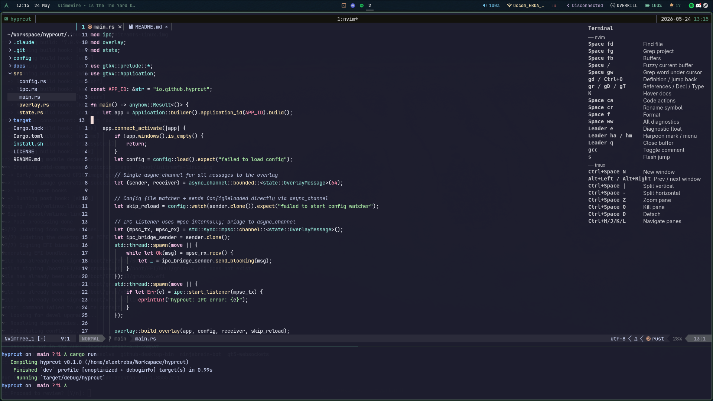

# hyprcut

A keyboard shortcut overlay for Hyprland. Shows shortcuts for whichever app is focused — disappears when you switch to an unconfigured window.



> **Note:** drag the overlay's title bar to reposition it. Position is saved per-app.

---

## Requirements

- Hyprland compositor
- `gtk4` and `gtk4-layer-shell` system libraries
- Rust toolchain

**Arch Linux:**
```bash
sudo pacman -S gtk4
# gtk4-layer-shell is in the AUR — install via yay or paru:
yay -S gtk4-layer-shell
```

**Ubuntu/Debian:** gtk4-layer-shell is not packaged — build it from source:
[https://github.com/wmww/gtk4-layer-shell](https://github.com/wmww/gtk4-layer-shell)

---

## Install

```bash
git clone https://github.com/AlexTrebs/hyprcut
cd hyprcut
./install.sh
```

The script builds the binary, installs it to `~/.local/bin/`, and offers to:
- Add `~/.local/bin` to your PATH
- Add `exec-once = hyprcut` to your Hyprland config

---

## Configuration

Config is created automatically at `~/.config/hyprcut/config.toml` on first run.

### Global settings

```toml
[overlay]
position = [100, 100]   # x, y offset from top-left corner
font_size = 14
opacity = 0.75
text = "rgba(255, 255, 255, 0.75)"
bg = "rgba(0, 0, 0, 0.5)"   # optional, defaults to transparent
```

### Adding an app

Find your app's window class while it's focused:
```bash
hyprctl activewindow | grep class
```

Then add a section using that class name (lowercase):

```toml
[apps.firefox]
name = "Firefox"
shortcuts = [
    { keys = "Ctrl+L",   label = "Address bar" },
    { keys = "Ctrl+T",   label = "New tab" },
    { keys = "Ctrl+W",   label = "Close tab" },
    { keys = "Ctrl+Tab", label = "Next tab" },
]
```

### Grouped shortcuts

```toml
[apps.nvim-terminal]
name = "Neovim"

[apps.nvim-terminal.shortcuts]
navigation = [
    { keys = "gg / G",  label = "Top / Bottom" },
    { keys = "Ctrl+]",  label = "Jump to definition" },
]
editing = [
    { keys = ":w",      label = "Save" },
    { keys = ":q",      label = "Quit" },
]
```

### Per-app color and position

```toml
[apps.zen]
name = "Zen Browser"
bg = "rgba(80, 80, 80, 0.65)"   # overrides global bg for this app
position = [1600, 500]           # per-app position, saved on drag
shortcuts = [...]
```

### Live reload

Edit `config.toml` and save — the overlay updates immediately without restart.

---

## Hyprland config

Add to `~/.config/hypr/hyprland.conf`:

```
exec-once = hyprcut
```

---

## License

MIT
